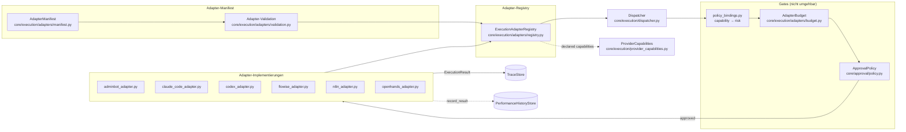
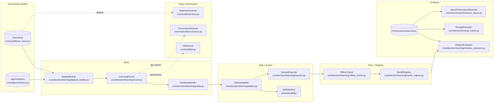

# Architecture Diagrams — Kernpfad, Plugin-Pfad, LearningOps

**Status:** Canonical
**Last reviewed:** 2026-04-19
**Scope:** Three Mermaid diagrams that anchor the three canonical flows
on `main`. Each diagram names the actual modules, classes, and stores
that carry the flow — not an idealised sketch.

This document closes §6.2 *"Architekturdiagramme für Kernpfad,
Plugin-Pfad, LearningOps"*. It complements the per-layer prose docs in
`docs/architecture/` (DECISION_LAYER_AND_NEURAL_POLICY,
HITL_AND_APPROVAL_LAYER, EXECUTION_LAYER_AND_AGENT_CREATION,
AUDIT_AND_EXPLAINABILITY_LAYER, MULTI_AGENT_ORCHESTRATION) by giving
them one-page visual indices.

For the companion machine-readable doc classification
(historical / canonical / experimental) see
`docs/reviews/phase_doc_audit_inventory.md`.

---

## 1. Kernpfad — Decision → Governance → Approval → Execution → Audit → Orchestration

The canonical request path: one user-visible task travels through the
six-layer stack and produces a trace, an execution result, and updated
per-agent performance history.

```mermaid
flowchart LR
    subgraph Entry["Externe Surfaces"]
        API["api_gateway/main.py<br/>FastAPI — einzige HTTP-Surface"]
        MCP["interfaces/mcp/<br/>einzige MCP-Surface"]
        CLI["scripts/abrain<br/>einzige CLI"]
        UI["frontend/agent-ui<br/>einzige UI"]
    end

    Core["services/core.py<br/>zentrale Service-Verdrahtung"]

    subgraph Decision["Decision"]
        Planner["Planner.plan()<br/>core/decision/planner.py"]
        Routing["RoutingEngine<br/>core/decision/routing_engine.py"]
        Policy["NeuralPolicyModel<br/>core/decision/neural_policy.py"]
    end

    subgraph Governance["Governance"]
        Capability["Capability / CapabilityRisk<br/>core/decision/capabilities.py"]
        AgentQuality["AgentQualitySummary<br/>core/decision/agent_quality.py"]
    end

    subgraph Approval["Approval (HITL)"]
        ApPolicy["ApprovalPolicy.evaluate()<br/>core/approval/policy.py"]
        ApStore["ApprovalStore<br/>core/approval/store.py"]
    end

    subgraph Execution["Execution"]
        Engine["ExecutionEngine.execute()<br/>core/execution/execution_engine.py"]
        Dispatch["Dispatcher.execute()<br/>core/execution/dispatcher.py"]
        Adapters["Adapter-Registry<br/>core/execution/adapters/"]
    end

    subgraph Audit["Audit"]
        TraceStore[("TraceStore<br/>core/audit/trace_store.py<br/>einzige Trace-Wahrheit")]
        AuditCtx["create_trace_context()<br/>core/audit/context.py"]
    end

    subgraph Orchestration["Orchestration"]
        Orchestrator["PlanExecutionOrchestrator<br/>core/orchestration/orchestrator.py"]
        StateStore["PlanStateStore<br/>core/orchestration/state_store.py"]
    end

    Perf[("PerformanceHistoryStore<br/>core/decision/performance_history.py<br/>einzige History-Wahrheit")]

    Entry --> Core
    Core --> Planner
    Planner --> Routing
    Routing --> Policy
    Policy --> Capability
    Capability --> AgentQuality
    AgentQuality --> ApPolicy
    ApPolicy -->|requires HITL| ApStore
    ApStore -->|approved / auto-approved| Engine
    ApPolicy -->|auto-approved| Engine
    Engine --> Dispatch
    Dispatch --> Adapters
    Adapters -->|ExecutionResult| Orchestrator
    Orchestrator --> StateStore
    Orchestrator --> AuditCtx
    AuditCtx --> TraceStore
    Adapters -.->|record_result| Perf
```

**Einzige Wahrheiten (Quellenangaben):**

- `TraceStore` (`core/audit/trace_store.py`) — einzige Trace-/Audit-Wahrheit
- `PerformanceHistoryStore` (`core/decision/performance_history.py`) — einzige History-Wahrheit
- `ApprovalStore` (`core/approval/store.py`) — einzige HITL-Wahrheit
- `PlanStateStore` (`core/orchestration/state_store.py`) — einzige durable Plan-State-Wahrheit
- `api_gateway/main.py` / `interfaces/mcp/` / `scripts/abrain` /
  `frontend/agent-ui` — je die *einzige* Surface der jeweiligen Art;
  keine zweite HTTP-/MCP-/CLI-/UI-Surface.

**Invarianten, die das Diagramm visuell pinnt:**

- Entry-Points geben ausschließlich an `services/core.py` ab — kein
  Entry-Point führt Business-Logik aus.
- `Decision` entscheidet, `Governance` filtert, `Approval` autorisiert,
  `Execution` handelt, `Audit` persistiert, `Orchestration` koordiniert
  — die Pfeilrichtung zwischen den Layern kehrt nicht um.
- `TraceStore` und `PerformanceHistoryStore` werden von Adaptern /
  Kontext gefüttert, aber nie parallelisiert — jeder zusätzliche
  Schreibpfad würde eine zweite Wahrheit erzeugen.

---

## 2. Plugin-Pfad — Adapter-Registry und Capability-Gates

Externe Tools (adminbot, claude-code, codex, flowise, n8n, openhands)
erreichen den Kernpfad ausschließlich als `ExecutionAdapter` unter
`core/execution/adapters/`. Jede Plugin-Kontaktfläche durchläuft
dieselben Governance-, Budget- und Audit-Gates wie ein interner
Agent — ohne Sondertür.

**Invarianten, die das Plugin-Pfad-Diagramm pinnt:**

- Jeder externe Adapter erbt von `core/execution/adapters/base.py`;
  keine Adapter-Parallele (zweite Registry, zweiter Dispatcher,
  Shadow-Execution-Pfad) ist zulässig.
- Capability-Gate, Budget-Gate und Approval-Gate sind *seriell* — kein
  Adapter führt ohne alle drei aus.
- `ExecutionAdapterRegistry` ist die alleinige Quelle deklarierter
  Adapter-Capabilities für `ProviderCapabilities`; ein Adapter, der
  seine Capabilities direkt an `Dispatcher` meldet, wäre eine zweite
  Wahrheit.
- Adapter-Ausführungen enden immer im `TraceStore` und aktualisieren
  die `PerformanceHistoryStore` — dieselben Stores wie der Kernpfad.

---

## 3. LearningOps-Pfad — vom Trace zum evaluierten Modell

§6.4 / Phase 5 produziert aus den kanonischen Stores reproduzierbare
Trainingsdatensätze, trainiert offline, registriert Artefakte und
vergleicht im Shadow-Modus. Keine Produktions-Latenz, keine zweite
Trace-/Approval-Wahrheit.

**Invarianten, die das LearningOps-Diagramm pinnt:**

- `LearningRecord` entsteht ausschließlich durch `DatasetBuilder` aus
  `TraceStore` + `ApprovalStore` — keine parallele Trainings-Historie.
- Governance-Schritte (`PiiDetector`, `ProvenanceScanner`,
  `RetentionScanner`) sind Seitenbetrachter auf dem kanonischen Feld
  — sie erzeugen keinen zweiten Lern-Datenstrom.
- `DatasetSplitter` produziert neben dem `DatasetSplit` immer ein
  `SplitManifest` (BLAKE2b-Fingerprint über sortierte `trace_id`s) —
  die Reproduzierbarkeit ist im Datenfluss verankert, nicht optional.
- `ModelRegistry` ist die alleinige Versionierungswahrheit für
  Modell-Artefakte; `ShadowEvaluator` liest gegen `PerformanceHistoryStore`,
  ohne sie zu mutieren.
- `EnergyEstimator` und `AgentPerformanceReporter` sind reine
  Read-Only-Konsumenten derselben `PerformanceHistoryStore` — zwei
  orthogonale Achsen (Kosten, Energie) über einer Wahrheit.

---

## 4. Pflege-Hinweise

- Diese Diagramme beschreiben den Stand von `main`. Bei Änderungen am
  Kern-, Plugin- oder LearningOps-Pfad diese Datei zusammen mit dem
  Code-Review aktualisieren; das Inventar
  `docs/reviews/phase_doc_audit_inventory.md` listet Architektur-Docs
  als canonical.
- Mermaid-Quellen sind absichtlich nicht als Bilder exportiert, damit
  Code-Review-Diffs den tatsächlichen Diagrammwechsel sehen.
- Neue kanonische Flows (z. B. Phase 6 Brain-v1 B6-S4 ff.) bekommen
  einen eigenen Abschnitt in dieser Datei, nicht eine
  Parallel-Datei — so bleibt die visuelle Indexseite eine.
