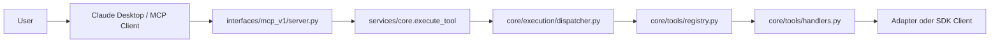

# ABrain MCP V1 Server Architecture

## Rolle im System

Der MCP-v1-Server ist nur ein Interface Layer. Er nimmt Requests externer MCP-Clients entgegen und delegiert jeden erlaubten Tool-Call an den gehärteten Core.

## Architekturdiagramm

## Abgrenzung

- MCP = Interface Layer
- Core = Execution Layer
- keine zweite Registry
- kein Dispatcher-Bypass
- kein direkter Adapter- oder Handler-Zugriff

## Security Model

- statische Allowlist
- keine generische Tool-Ausführung
- JSON-Schema-Validierung mit `additionalProperties: false`
- keine versteckten Parameter
- Tool-Ausführung ausschließlich über `services.core.execute_tool(...)`

## Betriebsform in V1

- primärer lokaler Transport: stdio
- primärer Client-Setup: VS Code MCP mit explizitem Venv-Pfad
- empfohlener Startpfad: installierter Console-Script-Entry `abrain-mcp`
- Python-Modulstart nur mit explizitem Interpreter und installiertem Projekt

## V1 Scope

- `list_agents`
- `adminbot_system_status`
- `adminbot_system_health`
- `adminbot_service_status`

Nicht Teil von V1:

- `dispatch_task`
- mutierende AdminBot-Tools
- HTTP-/SSE-Server
- Reaktivierung der historischen MCP-Pfade
