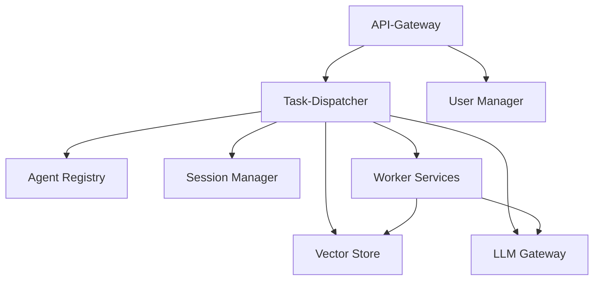
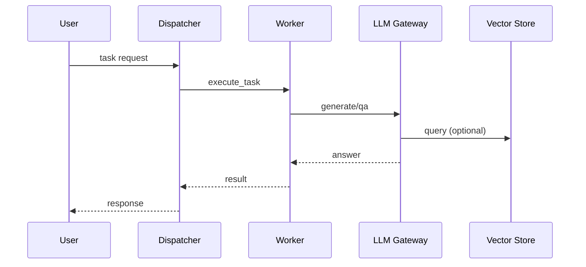

# MCP Overview

Hinweis: Diese Uebersicht beschreibt den frueheren `mcp/*`-Stack. Der aktuelle canonical runtime stack ist `services/*`; `mcp/*` bleibt nur `legacy (disabled)`.

The Modular Control Plane architecture breaks ABrain into small services that communicate over defined APIs. This overview outlines the main building blocks.



The following sequence shows the end-to-end flow after Phase&nbsp;3:



Each service can be scaled independently and replaced without touching the others. The dispatcher coordinates requests and uses the registry to find suitable workers. Session data and knowledge retrieval are handled by dedicated services.

### Historical Directory Layout

```
mcp/
├── task_dispatcher/
├── agent_registry/
├── session_manager/
├── vector_store/
├── llm_gateway/
├── user_manager/
├── worker_dev/
├── worker_loh/
└── worker_openhands/
```

Diese Verzeichnisstruktur ist kein produktiver Startpfad mehr. Der produktive Compose- und Service-Start liegt jetzt in `docker-compose.yml` und `services/*`.
