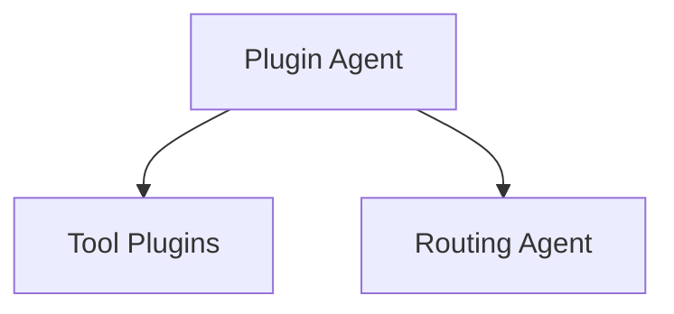

# Plugin Architecture

Die historische Plugin-Architektur bleibt nur noch als `legacy (disabled)` im
Repository. Dynamische Tool-Ausfuehrung ist nicht Teil des gehärteten
Sicherheitsmodells.

Plugins unter `plugins/` sind kein `canonical path` fuer neue
sicherheitsrelevante Funktionen. Der `PluginAgentService` bleibt nur als
`legacy (disabled)` Referenzpfad erhalten; generische Tool-Ausfuehrung ist
deaktiviert. Der `canonical path` fuer kontrollierte Integrationen ist:

- `services/core.py`
- `core/execution/dispatcher.py`
- `core/tools/*`
