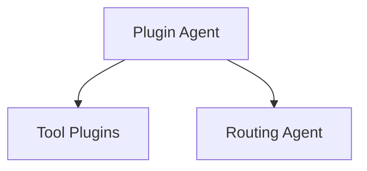

# Plugin Architecture

Die historische Plugin-Architektur bleibt nur noch als Legacy-Bestand im
Repository. Dynamische Tool-Ausfuehrung ist nicht Teil des gehärteten
Sicherheitsmodells.

Plugins unter `plugins/` sind kein kanonischer Integrationspfad fuer neue
sicherheitsrelevante Funktionen. Der `PluginAgentService` bleibt nur als
historischer Referenzpfad erhalten; generische Tool-Ausfuehrung ist deaktiviert.
Der kanonische Pfad fuer kontrollierte Integrationen ist:

- `services/core.py`
- `core/execution/dispatcher.py`
- `core/tools/*`
