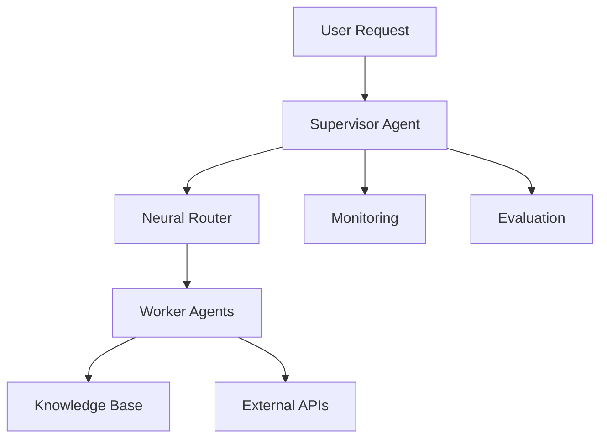

# ABrain Documentation

Welcome to the ABrain documentation. This documentation focuses on the current multi-agent and service stack in this repository, including the hardened core path and its surrounding integration points.
Current stable version: **v1.0.3**.

## Overview

ABrain is a multi-agent system that combines large language models (LLMs), task routing and service boundaries to provide a controlled execution framework. The current repository emphasizes:

- Dynamic agent creation and specialization
- Neural and rule-based task routing
- Integrated knowledge management
- A hardened dispatcher and tool layer
- Security-focused adapter integration

## Key Features

### Multi-agent System
- Dynamic agent creation and management
- Specialized worker agents for different domains
- Inter-agent communication and collaboration
- Task routing and delegation

### Neural Intelligence
- Neural network-based task matching
- Performance optimization through learning
- Feature extraction and analysis
- Adaptive agent selection

### Knowledge Management
- Integrated vector store
- Domain-specific knowledge bases
- Document ingestion and retrieval
- Semantic search capabilities

### Security & Monitoring
- Token-based authentication
- Input validation and filtering
- Rate limiting and access control
- Comprehensive logging and monitoring

### Evaluation & Analysis
- Performance metrics tracking
- A/B testing framework
- Cost analysis and optimization
- System-wide monitoring

## Getting Started
For a practical introduction, see the [User Guide](BenutzerHandbuch/index.md).

## Architecture Overview

The system consists of several key components:

For more details about the current system architecture, see the [Architecture Overview](architecture/overview.md).

## Contributing

We welcome contributions! Please see our [Contributing Guide](development/contributing.md) for details on how to get involved.

## License

This project is licensed under the MIT License - see the [LICENSE](https://github.com/EcoSphereNetwork/Agent-NN/blob/main/LICENSE) file for details.
