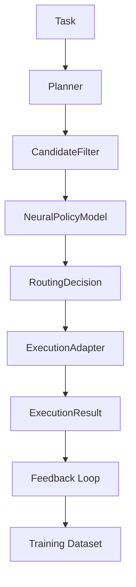

# ABrain Documentation

Welcome to the ABrain documentation. This documentation now focuses on the current foundations stack in this repository: canonical agent model, Flowise interop, decision layer, execution layer and learning system around the hardened core path.
Current foundations release: **v1.1.0**.

## Overview

ABrain is a multi-agent orchestration system that combines typed tool execution, deterministic policy checks and neural ranking to provide a controlled execution framework. The current repository emphasizes:

- Canonical `AgentDescriptor` modeling
- Deterministic planning and candidate filtering
- Always-on `NeuralPolicyModel` ranking
- Static execution adapters behind a separated execution layer
- Feedback-driven learning with best-effort training
- A hardened dispatcher and tool layer
- Security-focused adapter integration and interface boundaries

## Key Features

### Foundations Release
- Canonical agent model in `core/decision/*`
- Flowise import/export as a thin interoperability layer
- Planner, `CandidateFilter`, `NeuralPolicyModel` and `RoutingEngine`
- Execution engine with static adapter registry
- Learning dataset, reward model, online updater and trainer
- Hardened core dispatch path via `services/core.py`

## Getting Started
For the current developer-facing foundations path, start with [Project Overview](architecture/PROJECT_OVERVIEW.md), [Development Setup](setup/DEVELOPMENT_SETUP.md) and [Foundations Release Notes](releases/RELEASE_NOTES_FOUNDATIONS.md).

## Architecture Overview

The current foundations pipeline consists of these key stages:

For more details about the current system architecture, see the [Project Overview](architecture/PROJECT_OVERVIEW.md).

## Contributing

We welcome contributions! Please see our [Contributing Guide](development/contributing.md) for details on how to get involved.

## License

This project is licensed under the MIT License - see the local `LICENSE` file for details.
