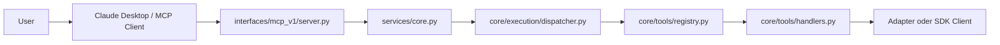

# ABrain MCP V1 Server

## Einordnung

Der MCP-v1-Server ist in ABrain nur ein externer Tool-Interface-Layer. Er stellt eine kleine, feste Tool-Fläche für lokale MCP-Clients bereit und delegiert jede Ausführung an den gehärteten Core.

## Architektur

## Klare Abgrenzung

- MCP = Interface Layer
- Core = Execution Layer
- Registry/Handler bleiben Teil des kanonischen Core-Pfads

Der MCP-Server ruft weder Handler noch Adapter direkt auf.

## Security Model

- feste Allowlist, kein dynamischer Tool-Passthrough
- JSON-Schema-Validierung mit `additionalProperties: false`
- keine freie Action-Schicht
- unbekannte Tools und ungültige Argumente werden als JSON-RPC-Fehler abgelehnt
- Tool-Ausführungsfehler werden strukturiert zurückgegeben

## V1 Tool Scope

- `list_agents`
- `adminbot_system_status`
- `adminbot_system_health`
- `adminbot_service_status`

Bewusst nicht Teil von V1:

- `dispatch_task`
- generische Tool-Ausführung
- mutierende AdminBot-Operationen
- entfernte HTTP-/SSE-Servervarianten

## Legacy-Abgrenzung

Die historischen Pfade unter `agentnn/mcp/*` und `mcp/plugin_agent_service/*` bleiben `legacy (disabled)` und sind kein Teil dieses Servers.
