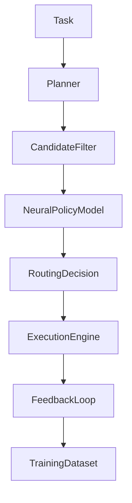

# ABrain Overview

ABrain verbindet einen gehärteten Core, ein kanonisches Agentenmodell und klar getrennte Decision-, Execution- und Interface-Layer. Der aktuelle Foundations-Stand ist nicht mehr durch historische MCP-Altpfade definiert, sondern durch den Referenzpfad `services/core.py -> core/*`.

## Komponenten

- **Hardened Core** – feste Tool-Registry, Dispatcher und getypte Tool-Modelle
- **Canonical Agent Model** – `AgentDescriptor`, `Capability`, `AgentRegistry`
- **Decision Layer** – Planner, `CandidateFilter`, `NeuralPolicyModel`, `RoutingEngine`
- **Execution Layer** – statische Adapter-Registry und `ExecutionEngine`
- **Learning System** – Dataset, Reward, OnlineUpdater, Trainer, Persistence
- **Interface Layer** – MCP v1 und Flowise-Interop als dünne Außenkanten
- **SDK / CLI** – bestehende technische Einstiegspfade wie `agentnn`

Weitere Informationen finden sich in `docs/architecture/PROJECT_OVERVIEW.md` und `docs/releases/FOUNDATIONS_RELEASE_SCOPE.md`.
